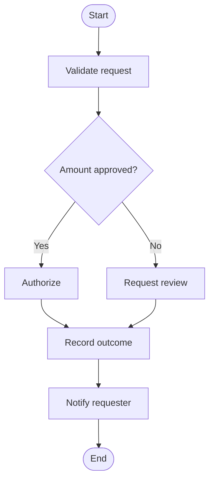

# Gyrfalcon Agent

A self-improving AI agent with persistent memory, session management, skill creation, multi-platform messaging, and pluggable infrastructure.

## Features

- **Core Agent**: Tool-calling conversation loop with context compression and budget tracking
- **Multiple UIs**: CLI (prompt_toolkit), TUI (Ink/React), Web Dashboard (React + FastAPI)
- **Plugin System**: General plugins, memory providers, model providers
- **MCP Support**: Connect external MCP tool servers
- **Skills**: LLM instruction sets with lifecycle management
- **Cron**: Scheduled autonomous agent tasks
- **Gateway**: Multi-platform message routing framework
- **Providers**: GitHub Copilot (device auth), AWS Bedrock, OpenAI, Anthropic
- **Visual Flows**: Publish versioned workflows, run them manually or on a schedule, and inspect each activity's status and captured context in the dashboard

## Visual Flows

The dashboard's flow designer lets you build and publish versioned workflows from Activities, decisions, and nested Process flows. Deployments pin a published version and can be started manually, on a schedule, or through the flow endpoint. Runs are persisted and can be inspected in the flow graph, including activity inputs, outputs, attributes, and attempts.

Execution proceeds from the failed Activity when an operator retries a run: completed Activities are retained, and the failed Activity reuses its saved context checkpoint. External side effects such as payments should still use an idempotency key or a status check so a retry does not repeat an operation that already succeeded.

Example of a decision choosing one branch before the flow rejoins:



The branches are alternatives selected by the decision; they do not run in parallel. The dashboard also provides a sample flow with ten Activities and several decision forks for exercising execution and graph inspection.

## Quick Start

```bash
# Install with uv
uv sync

# Run interactive CLI
gyrfalcon

# Run TUI
gyrfalcon --tui

# Run web dashboard
gyrfalcon dashboard

# Run setup wizard
gyrfalcon setup
```

## Configuration

Config lives in `~/.gyrfalcon/config.yaml`. Use `gyrfalcon setup` for interactive configuration.

## License

MIT
